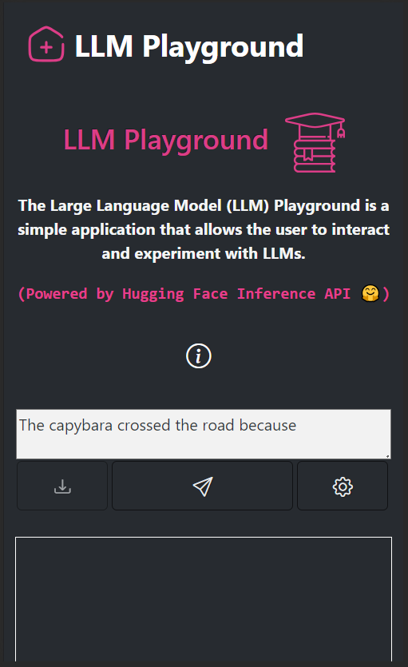

# LLM Playground with Dash 📚🤖

This repository contains a simple `Dash` application that runs a Large Language Model playground (i.e., a place to interact and experiment with them) powered by the Hugging Face Inference API. The app is responsive and works well on mobile too.

## Installation ⚙️

1. Clone the repository: `git clone https://github.com/username/repo.git`
2. Install the required packages: `pip install -r requirements.txt`

## Usage 🕹️

1. Add your Hugging Face API token (is free) to the `config.env` file.
2. Run the application: `python app.py`
3. Open a web browser and navigate to `http://localhost:8050`
4. Have fun using it! 🤗

## Contributing 🤝

1. Fork the repository
2. Create a new branch: `git checkout -b feature-name`
3. Make changes and commit: `git commit -am 'Add some feature'`
4. Push to the branch: `git push origin feature-name`
5. Submit a pull request

## License 📜

This project is licensed under the [MIT License](https://opensource.org/licenses/MIT).